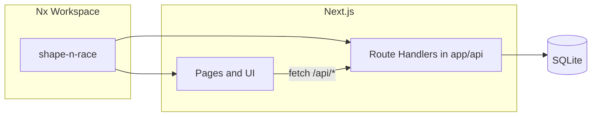

# Pinewood Derby – Nx Next.js + Backend Plan

## Architecture

- **Monorepo**: Single Nx workspace with **one app** – Next.js app **shape-n-race** (`apps/shape-n-race`) using the **App Router**.
- **Backend**: Next.js **Route Handlers** (`app/api/.../route.ts`) act as the API—no separate Express or NestJS. Handlers serve JSON for cars, votes, heats, heat results, and the data-entry password check.
- **Data**: Use one ORM (Drizzle or Prisma) with env-based connection. **Local / Docker**: SQLite (file or container volume). **Vercel**: Hosted DB (see below)—SQLite does not persist on Vercel's serverless runtime.

---

## 1. Nx + app scaffolding

- Create Nx workspace with a Next.js app (e.g. `npx create-nx-workspace@latest` and choose a preset that adds Next.js, or add Next.js via `@nx/next`).
- No separate API app: the Next.js app **is** the backend. API lives under `apps/shape-n-race/app/api/` as Route Handlers (e.g. `app/api/cars/route.ts`, `app/api/votes/route.ts`). Frontend calls relative URLs like `/api/cars` (same origin, no CORS).

---

## 2. Data model and API (inside Next.js)

**Pinewood Derby context**: After the build, each car has **3 photos**. Parents/users vote on **3–5 criteria** (e.g. Best design, Most creative—you'll define later). Races are **4 lanes**; each heat result is entered as **place 1–4** per car.

- **Cars**: `id`, `name`, `description?`, `**imageUrls**` (array of 3 paths or URLs—one per photo), `createdAt`. Images in `public/` or uploaded and served via Next.js.
- **VoteCriteria**: `id`, `name`, `order`. 3–5 rows (e.g. "Best design", "Most creative"). Criteria defined later; schema supports adding/editing via data entry or seed.
- **Votes**: `id`, `carId`, `**criterionId**`, `sessionId` (or fingerprint), `createdAt`. One vote per car **per criterion** per session (optional). Parents vote on each of the 3–5 criteria (e.g. pick one car per criterion, or rate—TBD when you define criteria).
- **Heats**: `id`, `name`/`label`, `order`, `createdAt`.
- **HeatResults**: `id`, `heatId`, `**place**` (1–4), `carId`, optional `lane` (1–4), optional `timeMs`. **4 lanes**; each heat has 4 results (place 1, 2, 3, 4). Data entry: enter which car finished 1st, 2nd, 3rd, 4th for that heat.

**Route Handlers** under `app/api/`: `GET/POST /api/cars`, `GET/POST /api/vote-criteria`, `GET/POST /api/votes` (include criterionId), `GET/POST /api/heats`, `GET/POST /api/heats/[id]/results`, `POST /api/admin/verify`. DB access (SQLite + ORM) in shared lib or server-side code.

---

## 3. Pages and features

| Page           | Route                       | Purpose                                                                                                                                                         |
| -------------- | --------------------------- | --------------------------------------------------------------------------------------------------------------------------------------------------------------- |
| **Home**       | `/`                         | **Intro + about (Pinewood Derby)**: hero with intro copy; ideally **video as background**. Content: what the derby is, rules, contact. Nav to Vote and Results. |
| **Voting**     | `/vote`                     | Show each car with **3 photos**; parents/users vote on **3–5 criteria** (TBD—e.g. Best design, Most creative). One vote per criterion per session (optional).   |
| **Results**    | `/results`                  | **Public**: list heats; each heat shows **4 lanes / place 1–4** with car and optional time. Read-only.                                                          |
| **Data entry** | **Hidden** `/results/enter` | **Password-gated**: form to create heat and enter **place 1–4** for each car in that heat (4-lane race).                                                        |

- **Password modal**: Simple React modal (or small component) on the data-entry route: single input + "Submit". On submit, call `POST /api/admin/verify`; if 200, set a flag in sessionStorage and render the data-entry form; if 401, show "Wrong password". No user accounts.

---

## 3b. Styling and responsiveness

- **Tailwind CSS** for styling and responsiveness. Tailwind is a strong default for React/Next.js: utility-first, responsive breakpoints (`sm:`, `md:`, `lg:`), no runtime, works well with component libraries. Add via `@nx/next` or `tailwindcss` in the Next app; use `tailwind.config.js` (or Tailwind v4 with PostCSS). No need for a different style system unless you have specific requirements (e.g. design tokens from Figma—Tailwind can cover that with theme extend).

---

## 4. Implementation order

1. **Nx workspace**: Create workspace with one Next.js app (`apps/shape-n-race`, project name **shape-n-race**).
2. **DB + API**: Add SQLite + ORM; define schema (Cars with 3 imageUrls, VoteCriteria, Votes with criterionId, Heats, HeatResults with place 1–4). Route Handlers: cars, vote-criteria, votes, heats, heats/[id]/results, admin/verify.
3. **Shell + Tailwind**: Layout, nav (Home, Vote, Results – no data-entry link), routes for `/`, `/vote`, `/results`. Add and configure Tailwind in the Next app for styling and responsiveness.
4. **Home page**: Intro + about content; video as background (ideally) – e.g. `<video>` full-bleed, muted, loop, autoplay; overlay with copy and CTA to Vote/Results.
5. **Voting page** (`/vote`): Fetch cars (each with 3 photos) and vote criteria; show car gallery with 3 images per car; let user vote on each of 3–5 criteria (TBD). POST votes with criterionId; optional one vote per criterion per session.
6. **Race results (public)** (`/results`): Fetch heats and heat results; list heats; each heat shows place 1–4 (4 lanes) with car name and optional time.
7. **Data entry (hidden)** (`/results/enter`): Password modal; after verify, form to create heat and enter place 1–4 for each car in that heat (4-lane race). Optionally add/edit cars and 3 photos later.
8. **Car photos**: 3 photos per car—store in `public/cars/` or upload API; Cars use `imageUrls` array (length 3).

---

## 5. Security and config

- **Data entry**: Single env var `DATA_ENTRY_PASSWORD`; no user DB. HTTPS in production.
- **Voting**: Optional `sessionId` to enforce one vote per car **per criterion** per session. Criteria (3–5) defined later; schema supports VoteCriteria CRUD or seed.
- **Hidden link**: Do not add "Data entry" or "Admin" to nav or sitemap; link can be shared verbally or in a doc. Optionally add a simple `robots.txt` or meta so `/results/enter` is not indexed.

---

## 6. Local testing with Docker / Swarm

- **Dockerfile** for the Next.js app: Build with `next build`, use **standalone output** (Next.js emits a minimal Node server for containers). Base image `node:20-alpine`; copy `.next/standalone` and `public`; run `node server.js` (or the path Next/Nx uses for standalone). Nx: set `outputPath` / standalone in the Next.js project config so the Nx build produces the standalone bundle.
- **docker-compose.yml** (local): One service for the app (build from Dockerfile, port 3000); **database** either (a) SQLite via a bind mount so the DB file lives on the host and persists, or (b) a Postgres service and `DATABASE_URL` for the app. Add env file (e.g. `.env.local`) for `DATA_ENTRY_PASSWORD` and DB URL. Use `docker compose up` to run the full stack locally.
- **Swarm**: Keep the compose file **Swarm-friendly** (no build in production if you prefer; use pre-built image and configs/secrets for env). Then you can run the same stack with `docker stack deploy -c docker-compose.yml derby` for local multi-node testing. For a single-node "stack," `docker compose up` is enough; Swarm is optional for scaling tests.

---

## 7. Deploy to Vercel

- **Next.js on Vercel**: Connect the repo to Vercel and set the app's root (or Nx project) to the Next.js app **shape-n-race** (`apps/shape-n-race`). Vercel will build and deploy Route Handlers as serverless functions automatically.
- **Database on Vercel**: Vercel's serverless functions are stateless and ephemeral—**SQLite on the filesystem will not persist**. Use a **hosted database** for production:
  - **Vercel Postgres** (or **Neon**, **Supabase**) with `DATABASE_URL` in Vercel env, or
  - **Turso** (libSQL, SQLite-compatible) if you want to keep a SQLite-style API.
- **Single schema, two connections**: Same Drizzle/Prisma schema and migrations; local/Docker use SQLite (file or `file:./local.db`); Vercel uses `DATABASE_URL` pointing to the hosted DB. Run migrations in CI or via a one-off script against the production DB when deploying.
- **Env and secrets**: In Vercel, set `DATA_ENTRY_PASSWORD`, `DATABASE_URL`, and any other env. For uploads (car images), use Vercel Blob or an external store (e.g. S3); avoid writing to the serverless filesystem for persistence.
- **Car images on Vercel**: Prefer **Vercel Blob** or S3/Cloudflare R2 for uploads; store URLs in the DB. For a minimal first version, you can use external image URLs or commit static images under `public/`.

---

## 8. Optional later enhancements

- Car photo upload UI (3 photos per car; behind same password or modal).
- Export results to CSV.
- Real-time updates (e.g. polling or WebSocket) on results page during the event.

---

## Summary

- **Pinewood Derby**: After build, each car has **3 photos**; parents vote on **3–5 criteria** (you'll define later). Races are **4 lanes**; results entered as **place 1–4** per heat.
- **Home** (`/`): Intro + about (Pinewood Derby); video as background; nav to Vote and Results.
- **Voting** (`/vote`): Show each car with **3 photos**; vote on **3–5 criteria** (TBD); optional one vote per criterion per session.
- **Results** (`/results`): Public heat list; each heat shows **place 1–4** (4 lanes) with car and optional time. **Hidden** data-entry at `/results/enter` (password modal) to enter **place 1–4** per heat.
- **Styling**: **Tailwind CSS** for layout and responsiveness.
- **Local**: Docker/Swarm + SQLite; **Production**: Vercel + hosted DB; 3 photos per car (e.g. Vercel Blob or `public/`).

**Short answer**: Pinewood Derby app. Next.js = backend (Route Handlers). Cars have 3 photos; voting by 3–5 criteria (TBD); 4-lane race, place 1–4 per heat. Home + Vote + Results + hidden data entry; Tailwind; deploy to Vercel.

If you want, next step can be a concrete file/folder map (e.g. `apps/shape-n-race/app/vote/page.tsx`, `apps/shape-n-race/app/api/cars/route.ts`) or Nx generator commands to run in order (e.g. `npx nx dev shape-n-race`, `npx nx build shape-n-race`).
